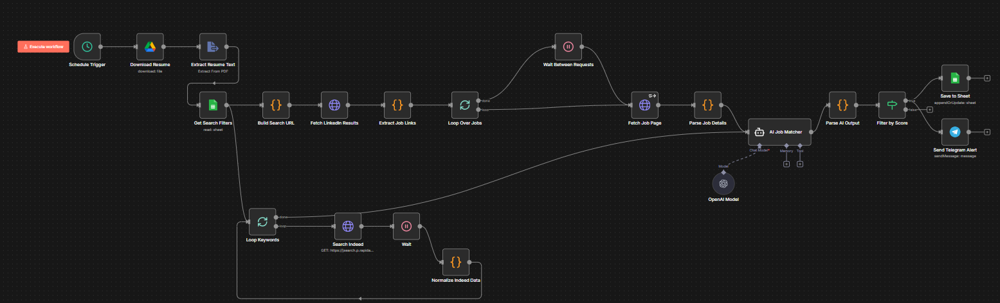

# AI Job Search Agent (Sudbury & Toronto)

Automated Job Hunting Pipeline built with n8n, OpenAI (GPT-4o-mini), and RapidAPI.

## Overview
As a Master of Computational Sciences graduate, I built this intelligent agent to automate the job hunt for IT and Data Analysis roles in Canada. The system aggregates opportunities from multiple platforms, uses LLMs to score relevance against my resume, and delivers high-priority alerts in real-time.

Key Metrics:
- Coverage: Scrapes LinkedIn and Indeed simultaneously.
- Efficiency: Filters out 90% of irrelevant listings using AI analysis.
- Speed: Delivers alerts to Telegram within minutes of posting.

## Architecture
The workflow utilizes a Multi-Branch Pipeline architecture:

1. LinkedIn Scraper Branch
   - Generates dynamic search URLs based on Google Sheet keywords.
   - Extracts job details using custom Regex and HTML parsing.

2. Indeed API Branch (Throttled)
   - Integrates via RapidAPI (JSearch).
   - Implements a Feedback Loop with 5-second delays to respect rate limits.

3. AI Analysis Core
   - Model: GPT-4o-mini.
   - Logic: Compares job descriptions vs. my PDF resume.
   - Outputs: 0-100 Match Score, Tailored Cover Letter, and ATS-Optimized Resume draft.

## How to Use
1. Import: Download workflow.json and import it into your n8n instance.
2. Credentials: Set up credentials for Google Drive, Sheets, Telegram, and OpenAI.
3. Configuration:
   - Create a Google Sheet with columns: Keyword, Location.
   - Add your Resume ID to the "Download Resume" node.
4. Run: Activate the Schedule Trigger for daily/hourly execution.

## Project Structure
- workflow.json: The complete source code for the automation agent.
- requirements.txt: List of required API services.

## 📸 Workflow Diagram

---
Built by Dhruv Patel | Sudbury, ON
